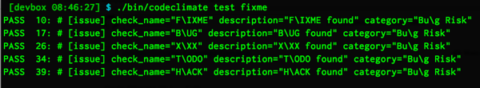
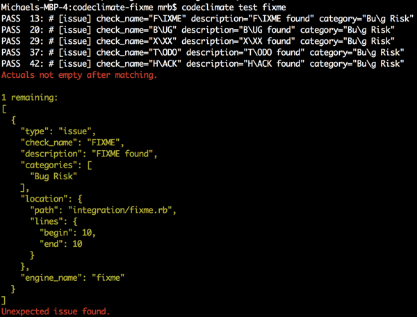

# Testing Code Climate Engines

The `codeclimate` CLI has a `test` command for automatically running a suite of regression tests that should be provided by the engine maintainer.

The tests described in this document are designed to assert that the results of your engine are what you expect. For that reason, it is designed at a particular level of granularity that allows for detailed assertions to be made about the position, categorization, and content of the issues emitted by your engine.

This document describes how to configure your engine to automatically run tests when `codeclimate test YOUR_ENGINE_NAME` is executed, describes the engine test format, and discusses integrating engine tests into your engine development workflow.

## Configuring Your Engine To Run Tests

Your engine can be configured to run tests by supplying path information in your engine's `engine.json` file:

```
{
  "name": "fixme",
  "description": "Discover lurking FIXMEs, BUGs, TODOs, etc. in your code",
  "maintainer": {
    "name": "Michael R. Bernstein",
    "email": "mrb@codeclimate.com"
  },
  "languages": ["*"],
  "test_paths": [
    "/usr/src/app/test/integration/"
  ]
}
```

*Note: By convention, the `engine.json` file must be in the root directory of your container.*

When `codeclimate test` is run, the `test_paths` are unpacked, and every file in the directory is run as a test (under the hood, we run `codeclimate analyze` with the `--engine` option and the test file path).

Now that your engine can run tests, let's learn about how they're written.

## Engine Test Format

Engine tests are designed to allow you to assert specific attributes of issues emitted by your engine. The tests themselves are implemented as inline comments in "fixture" files containing source code intended to emit issues. Here's a sample:

```
# [issue] check_name=BUG description="BUG found" category="Bug Risk"
# BUG: This should use double equals
if (foo = "foo")
  puts "You said foo"
end
```
The engine tests shown here This issue is saved in a `.rb` file that can be analyzed with the engine being tested. The presence of an `[issue]` tag indicates that the next line should report an issue. Each issue "marker" can specify an arbitrary number of `Issue` attributes. In the case above, we're asserting the following:

* `check_name=BUG`
* `description="BUG found"`
* `category="Bug Risk"`

*Note: The line number is implicitly tested by the placement of the comment.*

A precise specification of engine test format follows:

> An engine test is a comment in a source code file which begins with [issue] and is followed by 0 or more space-delimited `key="quoted value"` pairs describing attributes of the emitted issue.

Here's another example engine test:

```
# [issue] check_name="Dangerous Eval" description="Don't use eval."
```

For more example tests, check out [the integration tests for the Code Climate "FIXME" engine on GitHub here.](https://github.com/codeclimate/codeclimate-fixme/blob/master/test/integration/fixme.rb)

## Testing Your Engine With `codeclimate test`

Here are the results of running `codeclimate test` as they appear in the CLI when everything is working as expected:

<center></center>

You can see that there are 5 issues showing in the image, and they were all expected by the test file. In other words, they were all included as inline comments in the syntax described above, and `codeclimate test` found that the *expected* number of issues matched the *actual* number of issues emitted by the tool.

Sometimes, though, this isn't the case. If an issue was present in the output from the engine, but wasn't annotated with a comment in the test file, you might see output that looks like this:

<center></center>

You could fix this either by annotating the issue with a comment, or by removing the issue from the source file.

The flexibility in `codeclimate test` makes both TDD and writing specs after the fact valid and easy ways of providing a regression suite for your awesome Code Climate engine.

### Known issues

There are currently some known/open issues with the test tool's current implementation.

* Only works for issues that are emitted as line-based locations which are single line. Relatively easy to fix, as we'll just allow you to specify `location.positions.begin.line=X` `location.positions.begin.end=Y` attributes to be included inline.
* Won't work for analysis that requires an entire directory (e.g. Brakeman) yet. Deferred for now.
* It's not possible to specify more than one Issue category as array syntax breaks the regexp parser. Not an issue for now.
